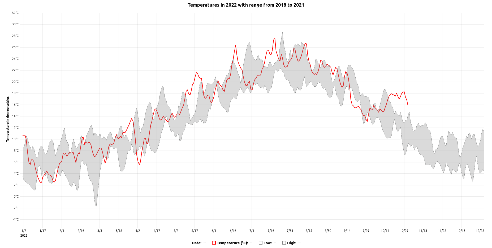
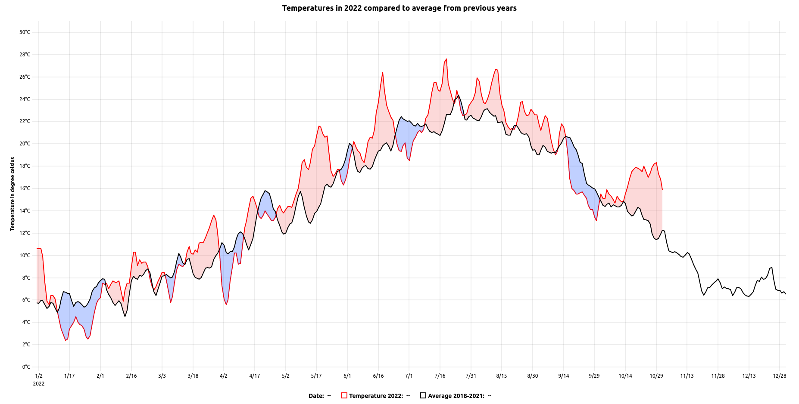

# uPlot

> R htmlwidget for [µPlot](https://github.com/leeoniya/uPlot) JavaScript library. μPlot is a fast, memory-efficient Canvas 2D-based chart for plotting time series, lines, areas, ohlc & bars.

<!-- badges: start -->
[](https://lifecycle.r-lib.org/articles/stages.html#experimental)
[](https://github.com/dreamRs/uPlot-r/actions/workflows/R-CMD-check.yaml)
<!-- badges: end -->


## Installation

You can install the development version of uPlot from [GitHub](https://github.com/dreamRs/uPlot-r) with:

```r
# install.packages("remotes")
remotes::install_github("dreamRs/uPlot-r")
```

## Example

Here's a time series in half-hourly steps over 11 years, representing a total of 1,710,612 points (9 series of 190,068).

```r
library(uPlot)
uPlot(
  data = eco2mix[, c(1, 3:11)],
  options = list(
    title = "Electricity production by sources in France (2012 - 2022)"
  )
) %>% 
  uColors(
    "bioenergies" = "#156956",
    "fuel" = "#80549f",
    "coal" = "#a68832",
    "solar" = "#d66b0d",
    "gas" = "#f20809",
    "wind" = "#72cbb7",
    "hydraulic" = "#2672b0",
    "nuclear" = "#e4a701",
    "pumping" = "#0e4269"
  )
```


Area ranges examples :

```r
uPlot(
  data = temperatures,
  options = list(
    title = "Temperatures in 2022 with range from 2018 to 2021"
  )
) %>% 
  uAxesY(
    label = "Temperature in degree celsius",
    values = htmlwidgets::JS("function(u, vals) {return vals.map(v => v + '°C');}")
  ) %>% 
  uBands("low", "high", fill = "#8485854D") %>% 
  uSeries("temperature", label = "Temperature (°C)", stroke = "red", width = 2) %>% 
  uSeries("low", label = "Low", stroke = "#848585", dash = c(8, 2)) %>% 
  uSeries("high", label = "High", stroke = "#848585", dash = c(8, 2)) %>% 
  uSeries("average", label = "Average", show = FALSE, stroke = "#111")
```




```r
uPlot(
  data = temperatures[, c(1, 2, 5)],
  options = list(
    title = "Temperatures in 2022 compared to average from previous years"
  )
) %>% 
  uAxesY(
    label = "Temperature in degree celsius",
    values = htmlwidgets::JS("function(u, vals) {return vals.map(v => v + '°C');}")
  ) %>% 
  uBands("temperature", "average", fill = "#F681804D") %>%
  uBands("average", "temperature", fill = "#2F64FF4D") %>% 
  uSeries(
    serie = "temperature",
    label = "Temperature 2022", 
    stroke = "red", 
    width = 2,
    value = htmlwidgets::JS("function(u, v) {return v + '°C';}")
  ) %>% 
  uSeries(
    serie = "average",
    label = "Average 2018-2021",
    stroke = "black",
    width = 2,
    value = htmlwidgets::JS("function(u, v) {return v + '°C';}")
  )
```



