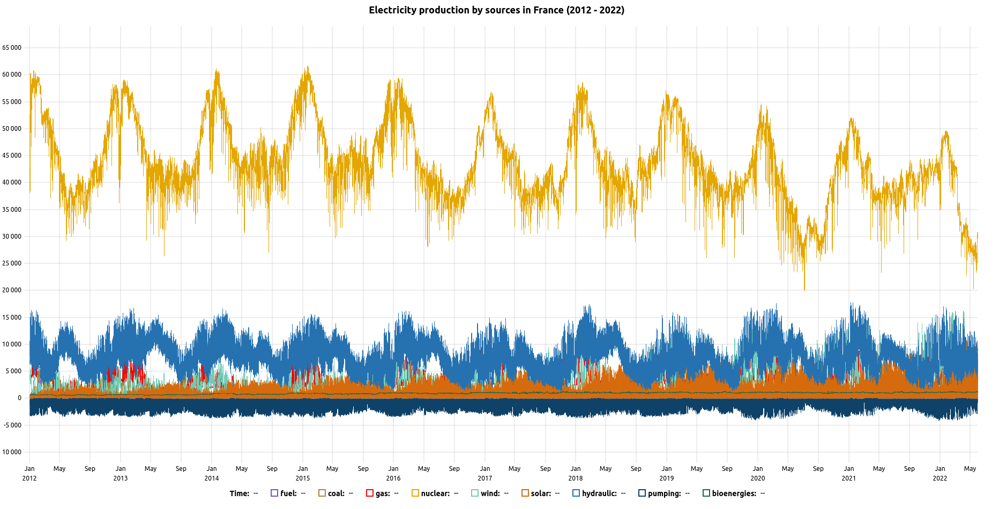

# uPlot

> R htmlwidget for [µPlot](https://github.com/leeoniya/uPlot) JavaScript library. μPlot is a fast, memory-efficient Canvas 2D-based chart for plotting time series, lines, areas, ohlc & bars.

<!-- badges: start -->
[](https://lifecycle.r-lib.org/articles/stages.html#experimental)
<!-- badges: end -->


## Installation

You can install the development version of uPlot from [GitHub](https://github.com/dreamRs/uPlot-r) with:

```r
# install.packages("remotes")
remotes::install_github("dreamRs/uPlot-r")
```

## Example

Here's a time series in half-hourly steps over 9 years, representing a total of 1,420,416 points (9 series of 157,824).

```r
library(uPlot)
# eco2mix colors
colors <- list(
  "bioenergies" = "#156956",
  "fuel" = "#80549f",
  "coal" = "#a68832",
  "solar" = "#d66b0d",
  "gas" = "#f20809",
  "wind" = "#72cbb7",
  "hydraulic" = "#2672b0",
  "nuclear" = "#e4a701",
  "pumping" = "#0e4269"
)
# plot production by energy sources
uPlot(
  data = eco2mix[, c(1, 3:11)],
  options = list(
    title = "Electricity production by sources in France (2012 - 2020)",
    series = c(
      list(
        list(label = "Time")
      ),
      lapply(
        X = names(eco2mix)[3:11],
        FUN = function(x) {
          list(label = x, stroke = colors[[x]])
        }
      )
    )
  )
)
```

