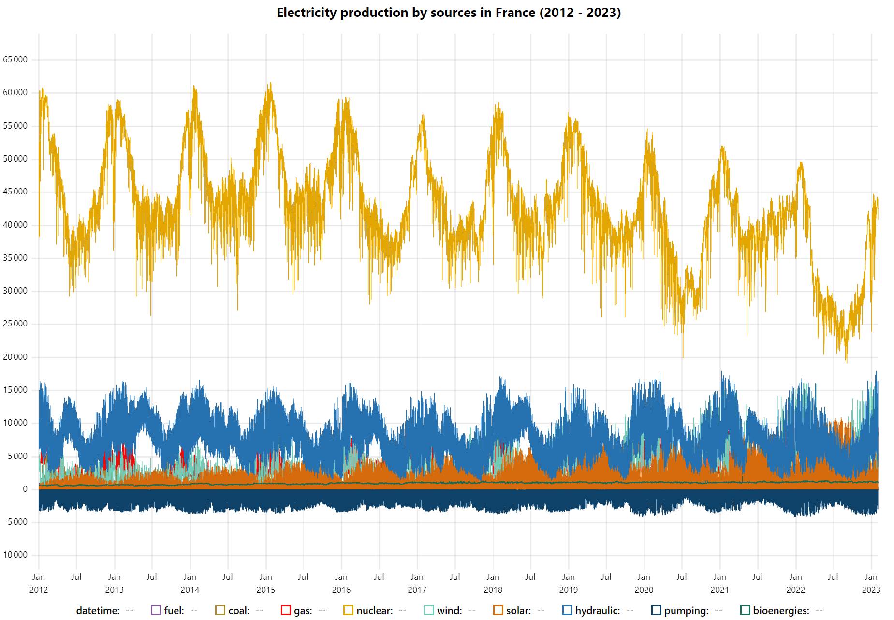

# uPlot

> R htmlwidget for [µPlot](https://github.com/leeoniya/uPlot) JavaScript library. μPlot is a fast, memory-efficient Canvas 2D-based chart for plotting time series, lines, areas, ohlc & bars.

<!-- badges: start -->
[](https://lifecycle.r-lib.org/articles/stages.html#experimental)
<!-- badges: end -->


:warning: Doesn't work in RStudio viewer. :warning:


## Installation

You can install the development version of uPlot from [GitHub](https://github.com/dreamRs/uPlot-r) with:

```r
# install.packages("remotes")
remotes::install_github("dreamRs/uPlot-r")
```

## Example

Here's a time series in half-hourly steps over 9 years, representing a total of 1,420,416 points (9 series of 157,824).

```r
library(uPlot)
uPlot(
  data = eco2mix[, c(1, 3:11)],
  options = list(
    title = "Electricity production by sources in France (2012 - 2020)",
    series = list(
      list(label = "Time"),
      list(label = "fuel", stroke = "#80549f"),
      list(label = "coal", stroke = "#a68832"),
      list(label = "gas", stroke = "#f20809"),
      list(label = "nuclear", stroke = "#e4a701"),
      list(label = "wind", stroke = "#72cbb7"),
      list(label = "solar", stroke = "#d66b0d"),
      list(label = "hydraulic", stroke = "#2672b0"),
      list(label = "pumping", stroke = "#0e4269"),
      list(label = "bioenergies", stroke = "#156956")
    )
  )
)
```

